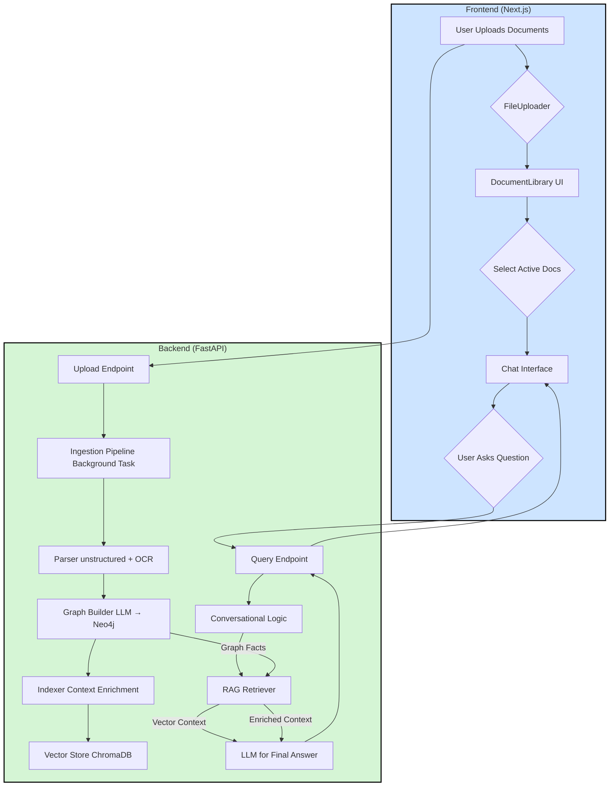

# CogniGraph RAG: Sistem Question-Answering Canggih dengan Knowledge Graph

[](https://nextjs.org/)
[](https://fastapi.tiangolo.com/)
[](https://python.org/)
[](https://neo4j.com/)
[](https://www.trychroma.com/)

> **Sistem Question-Answering Canggih yang Menggabungkan Knowledge Graph dengan Retrieval-Augmented Generation untuk Pemahaman Dokumen yang Mendalam**

## 🎯 Latar Belakang & Visi Proyek

**CogniGraph RAG** lahir dari tantangan umum di lingkungan dunia nyata, di mana sistem chatbot berbasis RAG standar seringkali gagal dalam:

1. **Ekstraksi Dangkal**: Tidak mampu memahami informasi dari tata letak dokumen yang kompleks
2. **Kebutaan Kontekstual**: Gagal membaca teks penting yang tertanam di dalam gambar (seperti tanda tangan, logo, atau detail infografis)
3. **Kurangnya Penalaran**: Kesulitan menjawab pertanyaan faktual yang membutuhkan pemahaman hubungan antar data

**Solusi**: CogniGraph RAG dirancang sebagai sistem cerdas yang mampu melakukan penalaran mendalam dengan meniru cara manusia memahami dokumen, menciptakan aplikasi yang mampu mengekstrak, menghubungkan, dan menyajikan informasi dengan tingkat akurasi mendekati manusia.

## ✨ Fitur Unggulan

### 🔍 **Ekstraksi Hibrida dengan OCR**
Menggabungkan analisis teks digital dengan **Optical Character Recognition (Tesseract)** untuk memastikan tidak ada satu kata pun yang terlewat, bahkan jika itu ada di dalam gambar.

### 🕸️ **Knowledge Graph Otomatis**
Secara cerdas mengekstrak entitas (Orang, Jabatan, Organisasi) dan hubungannya dari teks, lalu membangun **Knowledge Graph (Neo4j)** untuk pemahaman faktual yang presisi.

### 🧠 **Arsitektur Graph-RAG**
Mengimplementasikan arsitektur RAG canggih yang memperkaya potongan teks dengan fakta dari Knowledge Graph sebelum disimpan sebagai vektor, menyatukan pemahaman semantik dan faktual.

### 📚 **Penanganan Multi-Dokumen**
Antarmuka yang memungkinkan pengguna mengunggah beberapa dokumen sekaligus dan memilih dokumen mana yang akan diajak "bicara".

### 💬 **Antarmuka Percakapan Kontekstual**
Dilengkapi dengan *chat history* yang memungkinkan AI memahami pertanyaan lanjutan, menciptakan pengalaman pengguna yang alami dan intuitif.

### 🎨 **UI/UX Profesional**
Antarmuka yang bersih dan responsif dengan umpan balik pengguna yang jelas (status loading, notifikasi sukses/gagal) menggunakan `react-hot-toast`.

## 🏗️ Arsitektur Sistem



## 🔄 Alur Kerja Mendalam

### **Fase Ingesti (Membangun Pengetahuan)**

1. **Ekstraksi Dokumen**: Dokumen diproses oleh `unstructured.io` dengan strategi `hi_res`, mengekstrak teks digital dan teks dari gambar melalui Tesseract OCR.
2. **Pembangunan Knowledge Graph**: Teks lengkap dikirim ke LLM untuk diekstrak menjadi fakta terstruktur. Proses ini dilengkapi **mekanisme retry dengan exponential backoff** dan **parsing JSON yang kuat** untuk menangani kegagalan sementara dari API.
3. **Penyimpanan Graf**: Fakta-fakta disimpan ke dalam database graf **Neo4j**.
4. **Pengayaan Konteks**: Teks dipecah menjadi chunks dan diperkaya dengan fakta relevan dari Neo4j
5. **Vektorisasi**: "Super-chunks" yang sudah diperkaya diubah menjadi vektor menggunakan model `intfloat/multilingual-e5-large` dan disimpan di **ChromaDB**

### **Fase Retrieval (Menjawab Pertanyaan)**

1. **Rephrasing Pertanyaan**: Pertanyaan baru dan riwayat obrolan dikirim ke LLM untuk dibuat menjadi pertanyaan mandiri yang lengkap
2. **Pencarian Vektor**: Pertanyaan yang sudah lengkap diubah menjadi vektor dan digunakan untuk mencari "super-chunks" yang paling relevan dari ChromaDB
3. **Generasi Jawaban**: Konteks yang kaya, bersama dengan pertanyaan asli, dikirim ke LLM untuk dirangkai menjadi jawaban akhir yang akurat

## 🛠️ Tumpukan Teknologi

### **Frontend**
- **Framework**: Next.js 14.1.0
- **Language**: TypeScript
- **Styling**: Tailwind CSS
- **UI Feedback**: React Hot Toast
- **Markdown**: React Markdown with Remark GFM
- **Icons**: Lucide React
- **File Upload**: React Dropzone

### **Backend**
- **Framework**: FastAPI
- **Language**: Python 3.10+
- **Dependency Management**: Poetry

### **AI & Machine Learning**
- **LLM**: Google Gemini
- **Embedding Model**: `intfloat/multilingual-e5-large`
- **OCR Engine**: Tesseract
- **Framework**: LangChain
- **Logging**: Loguru

### **Database**
- **Vector Store**: ChromaDB
- **Graph Database**: Neo4j

### **Document Processing**
- **Parser**: Unstructured.io (dengan dukungan OCR)
- **Format Dukungan**: PDF, DOCX, dan format dokumen lainnya

## 🚀 Setup & Instalasi

### **Prasyarat**

Pastikan Anda telah menginstal:

1. **Node.js** (v18 atau lebih baru) & **NPM**
2. **Python** (3.10 atau lebih baru) & **Poetry**
3. **Tesseract OCR** - [Download di sini](https://github.com/tesseract-ocr/tesseract)
4. **Neo4j Desktop** - [Download di sini](https://neo4j.com/download/)
5. **Git** untuk cloning repository

### **2. Clone Repository**

```bash
git clone <repository-url>
cd cognigraph-rag
```

### **3. Setup Backend (FastAPI)**

1.  **Masuk ke direktori backend dan instal dependensi:**
    ```bash
    cd backend
    poetry install
    ```

2.  **Konfigurasi Environment (`.env`)**:
    - Di dalam direktori `backend`, salin file contoh menjadi file `.env` baru: `cp .env.example .env`.
    - Buka file `.env` dan isi nilainya:
        - `GOOGLE_API_KEY`: Dapatkan dari [Google AI Studio](https://makersuite.google.com/app/apikey).
        - Kredensial Neo4j (lihat langkah berikutnya).

3.  **Setup Neo4j Database**:
    - Buka **Neo4j Desktop**.
    - Buat *Project* baru, lalu buat *Database* baru (DBMS).
    - Klik **Start** pada database Anda. Setelah aktif, kredensial default biasanya:
        - **URI**: `bolt://localhost:7687`.
        - **Username**: `neo4j`.
    - Saat pertama kali connect, Anda akan diminta mengatur password baru. Gunakan password ini untuk `NEO4J_PASSWORD` di file `.env` Anda.

4.  **Setup Tesseract OCR**:
    - **Windows**: Unduh dan jalankan installer dari [UB-Mannheim/tesseract/wiki](https://github.com/UB-Mannheim/tesseract/wiki). Path default (`C:\Program Files\Tesseract-OCR\tesseract.exe`) sudah dikonfigurasi di `backend/config.py`. Jika Anda menginstal di lokasi lain, sesuaikan path tersebut.
    - **macOS (via Homebrew)**: `brew install tesseract`.
    - **Linux (Debian/Ubuntu)**: `sudo apt-get install tesseract-ocr`.

### **4. Setup Frontend (Next.js)**

1.  **Masuk ke direktori frontend dan instal dependensi:**
    ```bash
    cd ../frontend
    npm install
    ```

### **5. Menjalankan Aplikasi**

Anda perlu menjalankan dua terminal secara bersamaan.

- **Terminal 1: Jalankan Backend Server**:
  ```bash
  # Dari direktori backend/
  poetry run uvicorn app.main:app --reload --host 0.0.0.0 --port 8000
  ```

- **Terminal 2: Jalankan Frontend Server**:
  ```bash
  # Dari direktori frontend/
  npm run dev
  ```

Setelah kedua server berjalan, buka **[http://localhost:3000](http://localhost:3000)** di browser Anda.

## 📁 Struktur Proyek

```
cognigraph-rag/
├── backend/                  # Backend FastAPI
│   ├── app/                  # FastAPI application
│   │   ├── main.py           # API endpoints
│   │   └── schemas.py        # Pydantic models
│   ├── config.py             # Konfigurasi terpusat
│   ├── ingestion/            # Pipeline pemrosesan dokumen
│   ├── retrieval/            # Logika RAG
│   ├── data/                 # Data storage (ignored by git)
│   ├── pyproject.toml        # Dependensi Poetry
│   └── .env.example          # Template environment
├── frontend/                 # Frontend Next.js
│   ├── app/                  # Halaman utama
│   ├── components/           # Komponen React
│   ├── lib/                  # Fungsi utilitas
│   ├── package.json          # Dependensi NPM
│   └── tailwind.config.ts    # Konfigurasi Tailwind
└── README.md                 # Dokumentasi ini
```

## 🔧 Konfigurasi Lanjutan

### **Optimasi Performa**

- **Chunk Size**: Sesuaikan ukuran chunk di `backend/ingestion/indexer.py` berdasarkan jenis dokumen.
- **Embedding Model**: Ganti model embedding di `backend/config.py` sesuai kebutuhan bahasa.
- **Neo4j Memory**: Tingkatkan alokasi memori Neo4j untuk dataset yang lebih besar.

### **Keamanan**

- Jangan commit file `.env` ke repository
- Gunakan environment variables untuk production
- Implementasikan rate limiting untuk API endpoints

## 🧪 Penggunaan

### **1. Upload Dokumen**
- Drag & drop atau klik untuk upload dokumen
- Sistem akan otomatis memproses dan mengindeks dokumen
- Status pemrosesan ditampilkan secara real-time

### **2. Pilih Dokumen Aktif**
- Pilih dokumen yang ingin Anda ajak "bicara"
- Bisa memilih multiple dokumen untuk analisis lintas dokumen

### **3. Mulai Percakapan**
- Ketik pertanyaan dalam bahasa Indonesia atau Inggris
- Sistem akan memberikan jawaban berdasarkan konteks dokumen
- Riwayat percakapan dipertahankan untuk pertanyaan lanjutan

### **Contoh Pertanyaan:**
- "Siapa direktur keuangan perusahaan?"
- "Apa saja proyek yang disebutkan dalam dokumen?"
- "Berapa anggaran untuk proyek X?"
- "Siapa yang menandatangani surat ini?"

## 🔍 Troubleshooting

### **Masalah Umum**

**1. Tesseract OCR tidak ditemukan**
```
Solusi: Pastikan Tesseract terinstal dan path di config.py benar
```

**2. Neo4j connection error**
```
Solusi: Pastikan Neo4j database running dan kredensial di .env benar
```

**3. Google API quota exceeded**
```
Solusi: Periksa usage di Google Cloud Console dan upgrade plan jika perlu
```

**4. ChromaDB permission error**
```
Solusi: Pastikan folder data/chromadb memiliki permission write
```

### **Debug Mode**

Untuk debugging, set log level ke DEBUG di file konfigurasi:

```python
logging.basicConfig(level=logging.DEBUG)
```

## 🤝 Kontribusi

Kami menyambut kontribusi dari komunitas! Silakan:

1. Fork repository ini
2. Buat feature branch (`git checkout -b feature/AmazingFeature`)
3. Commit perubahan (`git commit -m 'Add some AmazingFeature'`)
4. Push ke branch (`git push origin feature/AmazingFeature`)
5. Buat Pull Request

## 📄 Lisensi

Proyek ini dilisensikan di bawah [MIT License](LICENSE).

## 🙏 Acknowledgments

- **Unstructured.io** untuk document parsing yang powerful
- **Neo4j** untuk graph database yang robust
- **ChromaDB** untuk vector storage yang efisien
- **Google AI** untuk model language yang canggih
- **Tesseract OCR** untuk optical character recognition

---

**Dibuat dengan ❤️ untuk meningkatkan cara kita berinteraksi dengan dokumen**

> *"Knowledge is power, but organized knowledge is wisdom."*
