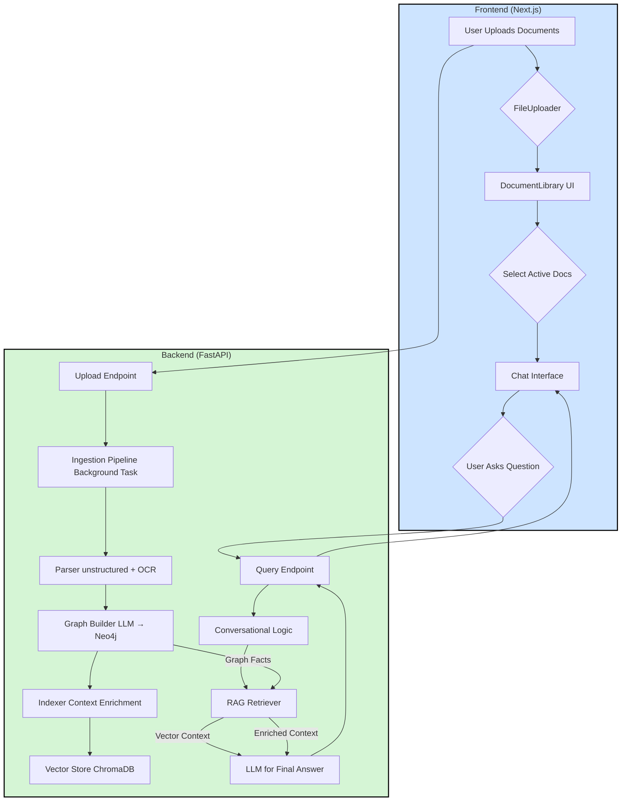

# CogniGraph RAG: Sistem Question-Answering Canggih dengan Knowledge Graph

[](https://nextjs.org/)
[](https://fastapi.tiangolo.com/)
[](https://python.org/)
[](https://neo4j.com/)
[](https://www.trychroma.com/)

> **Sistem Question-Answering Canggih yang Menggabungkan Knowledge Graph dengan Retrieval-Augmented Generation untuk Pemahaman Dokumen yang Mendalam**

## 🎯 Latar Belakang & Visi Proyek

**CogniGraph RAG** lahir dari tantangan nyata di lingkungan perusahaan, di mana sistem chatbot berbasis RAG standar seringkali gagal dalam:

1. **Ekstraksi Dangkal**: Tidak mampu memahami informasi dari tata letak dokumen yang kompleks
2. **Kebutaan Kontekstual**: Gagal membaca teks penting yang tertanam di dalam gambar (seperti tanda tangan, logo, atau detail infografis)
3. **Kurangnya Penalaran**: Kesulitan menjawab pertanyaan faktual yang membutuhkan pemahaman hubungan antar data

**Solusi**: CogniGraph RAG dirancang sebagai sistem cerdas yang mampu melakukan penalaran mendalam dengan meniru cara manusia memahami dokumen, menciptakan aplikasi yang mampu mengekstrak, menghubungkan, dan menyajikan informasi dengan tingkat akurasi mendekati manusia.

## ✨ Fitur Unggulan

### 🔍 **Ekstraksi Hibrida dengan OCR**
Menggabungkan analisis teks digital dengan **Optical Character Recognition (Tesseract)** untuk memastikan tidak ada satu kata pun yang terlewat, bahkan jika itu ada di dalam gambar.

### 🕸️ **Knowledge Graph Otomatis**
Secara cerdas mengekstrak entitas (Orang, Jabatan, Organisasi) dan hubungannya dari teks, lalu membangun **Knowledge Graph (Neo4j)** untuk pemahaman faktual yang presisi.

### 🧠 **Arsitektur Graph-RAG**
Mengimplementasikan arsitektur RAG canggih yang memperkaya potongan teks dengan fakta dari Knowledge Graph sebelum disimpan sebagai vektor, menyatukan pemahaman semantik dan faktual.

### 📚 **Penanganan Multi-Dokumen**
Antarmuka yang memungkinkan pengguna mengunggah beberapa dokumen sekaligus dan memilih dokumen mana yang akan diajak "bicara".

### 💬 **Antarmuka Percakapan Kontekstual**
Dilengkapi dengan *chat history* yang memungkinkan AI memahami pertanyaan lanjutan, menciptakan pengalaman pengguna yang alami dan intuitif.

### 🎨 **UI/UX Modern**
Antarmuka yang bersih, profesional, dan responsif dengan tema cerah, dirancang menggunakan Next.js dan Tailwind CSS.

## 🏗️ Arsitektur Sistem



## 🔄 Alur Kerja Mendalam

### **Fase Ingesti (Membangun Pengetahuan)**

1. **Ekstraksi Dokumen**: Dokumen diproses oleh `unstructured.io` dengan strategi `hi_res`, mengekstrak teks digital dan teks dari gambar melalui Tesseract OCR
2. **Pembangunan Knowledge Graph**: Teks lengkap dikirim ke LLM (Gemini Pro) untuk diekstrak menjadi fakta terstruktur (entitas dengan label seperti `:PERSON`, `:ROLE`, dan hubungannya)
3. **Penyimpanan Graf**: Fakta-fakta disimpan ke dalam database graf **Neo4j**
4. **Pengayaan Konteks**: Teks dipecah menjadi chunks dan diperkaya dengan fakta relevan dari Neo4j
5. **Vektorisasi**: "Super-chunks" yang sudah diperkaya diubah menjadi vektor menggunakan model `intfloat/multilingual-e5-large` dan disimpan di **ChromaDB**

### **Fase Retrieval (Menjawab Pertanyaan)**

1. **Rephrasing Pertanyaan**: Pertanyaan baru dan riwayat obrolan dikirim ke LLM untuk dibuat menjadi pertanyaan mandiri yang lengkap
2. **Pencarian Vektor**: Pertanyaan yang sudah lengkap diubah menjadi vektor dan digunakan untuk mencari "super-chunks" yang paling relevan dari ChromaDB
3. **Generasi Jawaban**: Konteks yang kaya, bersama dengan pertanyaan asli, dikirim ke LLM untuk dirangkai menjadi jawaban akhir yang akurat

## 🛠️ Tumpukan Teknologi

### **Frontend**
- **Framework**: Next.js 14.1.0
- **Language**: TypeScript
- **Styling**: Tailwind CSS
- **Icons**: Lucide React
- **File Upload**: React Dropzone

### **Backend**
- **Framework**: FastAPI
- **Language**: Python 3.10+
- **Dependency Management**: Poetry

### **AI & Machine Learning**
- **LLM**: Google Gemini Pro (gemini-2.5-flash)
- **Embedding Model**: `intfloat/multilingual-e5-large`
- **OCR Engine**: Tesseract
- **Framework**: LangChain

### **Database**
- **Vector Store**: ChromaDB
- **Graph Database**: Neo4j

### **Document Processing**
- **Parser**: Unstructured.io (dengan dukungan OCR)
- **Format Dukungan**: PDF, DOCX, dan format dokumen lainnya

## 🚀 Setup & Instalasi

### **Prasyarat**

Pastikan Anda telah menginstal:

1. **Node.js** (v18 atau lebih baru) & **NPM**
2. **Python** (3.10 atau lebih baru) & **Poetry**
3. **Tesseract OCR** - [Download di sini](https://github.com/tesseract-ocr/tesseract)
4. **Neo4j Desktop** - [Download di sini](https://neo4j.com/download/)
5. **Git** untuk cloning repository

### **Langkah 1: Clone Repository**

```bash
git clone <repository-url>
cd next-rag
```

### **Langkah 2: Setup Backend**

```bash
cd backend

# Install dependencies menggunakan Poetry
poetry install

# Copy dan konfigurasi environment variables
cp .env.example .env
```

**Konfigurasi file `.env`:**

```env
# Google API Key (wajib)
GOOGLE_API_KEY="your_google_api_key_here"

# Model LLM (opsional, default: gemini-2.5-flash)
LLM_MODEL_NAME="gemini-2.5-flash"

# Neo4j Configuration (sesuaikan dengan setup Neo4j Anda)
NEO4J_URI="bolt://localhost:7687"
NEO4J_USERNAME="neo4j"
NEO4J_PASSWORD="your_neo4j_password"
```

**Konfigurasi Tesseract OCR:**

Pastikan Tesseract OCR terinstal dan path-nya benar di `backend/core/config.py`:

```python
# Untuk Windows
TESSERACT_PATH = r"C:\Program Files\Tesseract-OCR\tesseract.exe"

# Untuk macOS (via Homebrew)
# TESSERACT_PATH = "/usr/local/bin/tesseract"

# Untuk Linux
# TESSERACT_PATH = "/usr/bin/tesseract"
```

### **Langkah 3: Setup Neo4j Database**

1. Buka **Neo4j Desktop**
2. Buat database baru dengan nama `cognigraph-rag`
3. Set password untuk user `neo4j`
4. Start database
5. Pastikan konfigurasi di `.env` sesuai dengan setup Neo4j Anda

### **Langkah 4: Setup Frontend**

```bash
cd ../frontend

# Install dependencies
npm install
```

### **Langkah 5: Menjalankan Aplikasi**

**Terminal 1 - Backend:**
```bash
cd backend
poetry run uvicorn app.main:app --reload --host 0.0.0.0 --port 8000
```

**Terminal 2 - Frontend:**
```bash
cd frontend
npm run dev
```

**Akses Aplikasi:**
- Frontend: http://localhost:3000
- Backend API: http://localhost:8000
- API Documentation: http://localhost:8000/docs

## 📁 Struktur Proyek

```
next-rag/
├── backend/                    # Backend FastAPI
│   ├── app/                   # Aplikasi utama
│   │   ├── main.py           # Entry point & API endpoints
│   │   └── schemas.py        # Pydantic models
│   ├── core/                 # Konfigurasi inti
│   │   └── config.py         # Environment variables & settings
│   ├── ingestion/            # Pipeline pemrosesan dokumen
│   │   ├── parser.py         # Document parsing dengan OCR
│   │   ├── graph_builder.py  # Knowledge graph extraction
│   │   ├── indexer.py        # Context enrichment & vectorization
│   │   ├── ocr_config.py     # Tesseract OCR configuration
│   │   └── pipeline.py       # Orchestration pipeline
│   ├── retrieval/            # Sistem retrieval & QA
│   │   ├── conversational_logic.py  # Question rephrasing
│   │   ├── hybrid_retriever.py      # Graph-enhanced RAG
│   │   └── qa_chain.py              # Question answering chain
│   ├── models/               # Data models
│   ├── data/                 # Data storage
│   │   ├── uploads/          # Uploaded documents
│   │   └── chromadb/         # Vector database
│   ├── pyproject.toml        # Poetry dependencies
│   └── .env.example          # Environment template
├── frontend/                  # Frontend Next.js
│   ├── app/                  # Next.js App Router
│   │   ├── page.tsx          # Main page
│   │   └── layout.tsx        # Root layout
│   ├── components/           # React components
│   │   ├── ChatInterface.tsx # Chat UI dengan history
│   │   ├── DocumentLibrary.tsx # Document management
│   │   ├── FileUploader.tsx  # File upload component
│   │   └── Message.tsx       # Message display component
│   ├── lib/                  # Utilities
│   │   └── api.ts           # API client functions
│   ├── package.json          # NPM dependencies
│   └── tailwind.config.ts    # Tailwind configuration
└── README.md                 # Dokumentasi ini
```

## 🔧 Konfigurasi Lanjutan

### **Mendapatkan Google API Key**

1. Kunjungi [Google AI Studio](https://makersuite.google.com/app/apikey)
2. Buat API key baru
3. Copy dan paste ke file `.env`

### **Optimasi Performa**

- **Chunk Size**: Sesuaikan ukuran chunk di `indexer.py` berdasarkan jenis dokumen
- **Embedding Model**: Ganti model embedding di `config.py` sesuai kebutuhan bahasa
- **Neo4j Memory**: Tingkatkan alokasi memory Neo4j untuk dataset besar

### **Keamanan**

- Jangan commit file `.env` ke repository
- Gunakan environment variables untuk production
- Implementasikan rate limiting untuk API endpoints

## 🧪 Penggunaan

### **1. Upload Dokumen**
- Drag & drop atau klik untuk upload dokumen
- Sistem akan otomatis memproses dan mengindeks dokumen
- Status pemrosesan ditampilkan secara real-time

### **2. Pilih Dokumen Aktif**
- Pilih dokumen yang ingin Anda ajak "bicara"
- Bisa memilih multiple dokumen untuk analisis lintas dokumen

### **3. Mulai Percakapan**
- Ketik pertanyaan dalam bahasa Indonesia atau Inggris
- Sistem akan memberikan jawaban berdasarkan konteks dokumen
- Riwayat percakapan dipertahankan untuk pertanyaan lanjutan

### **Contoh Pertanyaan:**
- "Siapa direktur keuangan perusahaan?"
- "Apa saja proyek yang disebutkan dalam dokumen?"
- "Berapa anggaran untuk proyek X?"
- "Siapa yang menandatangani surat ini?"

## 🔍 Troubleshooting

### **Masalah Umum**

**1. Tesseract OCR tidak ditemukan**
```
Solusi: Pastikan Tesseract terinstal dan path di config.py benar
```

**2. Neo4j connection error**
```
Solusi: Pastikan Neo4j database running dan kredensial di .env benar
```

**3. Google API quota exceeded**
```
Solusi: Periksa usage di Google Cloud Console dan upgrade plan jika perlu
```

**4. ChromaDB permission error**
```
Solusi: Pastikan folder data/chromadb memiliki permission write
```

### **Debug Mode**

Untuk debugging, set log level ke DEBUG di file konfigurasi:

```python
logging.basicConfig(level=logging.DEBUG)
```

## 🤝 Kontribusi

Kami menyambut kontribusi dari komunitas! Silakan:

1. Fork repository ini
2. Buat feature branch (`git checkout -b feature/AmazingFeature`)
3. Commit perubahan (`git commit -m 'Add some AmazingFeature'`)
4. Push ke branch (`git push origin feature/AmazingFeature`)
5. Buat Pull Request

## 📄 Lisensi

Proyek ini dilisensikan di bawah [MIT License](LICENSE).

## 🙏 Acknowledgments

- **Unstructured.io** untuk document parsing yang powerful
- **Neo4j** untuk graph database yang robust
- **ChromaDB** untuk vector storage yang efisien
- **Google AI** untuk model language yang canggih
- **Tesseract OCR** untuk optical character recognition

---

**Dibuat dengan ❤️ untuk meningkatkan cara kita berinteraksi dengan dokumen**

> *"Knowledge is power, but organized knowledge is wisdom."*
